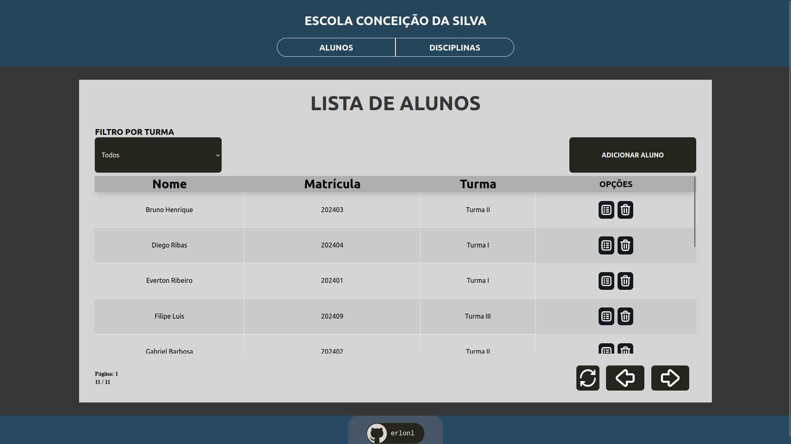

# ProjetoBD
ProjetoBD é o repositório para o projeto final da disciplina de Banco de Dados I com Marcelo Iury



## Descrição
Desenvolvido utilizando React TS, Node JS e MySQL, o ProjetoBD - Escola Conceição da Silva  
é uma aplicação web para gerenciamento de alunos, professores, disciplinas e turmas de uma escola.

## Rodando o projeto
Requisitos:
- [Node JS](https://nodejs.org)
- [Docker](https://www.docker.com/)

A estrutura atual do projeto é dividida em duas partes:
- `server`: API RESTful desenvolvida em Node JS
- `client`: Interface web desenvolvida em React TS

### Server
Acesse a pasta `server` e rode o projeto:
```bash
$ cd server
$ npm install
$ npm run dev
```

### Client
Acesse a pasta `client` e rode o projeto:
```bash
$ cd client
$ npm install
$ npm run start
```

### Banco de Dados
Utilizando um terminal, utilize o comando abaixo:
```bash
docker run --name escola -p 3306:3306 -e 'MYSQL_ROOT_PASSWORD=suasenha' mysql
```

- Substitua `suasenha` pela senha que deseja para o banco de dados.
- Não se preocupe em instalar o MySQL, o Docker cuidará disso para você.

Informações com relação às especificações do projeto no PDF: 
[ProjetoCRUD](/ProjetoCRUD.pdf)